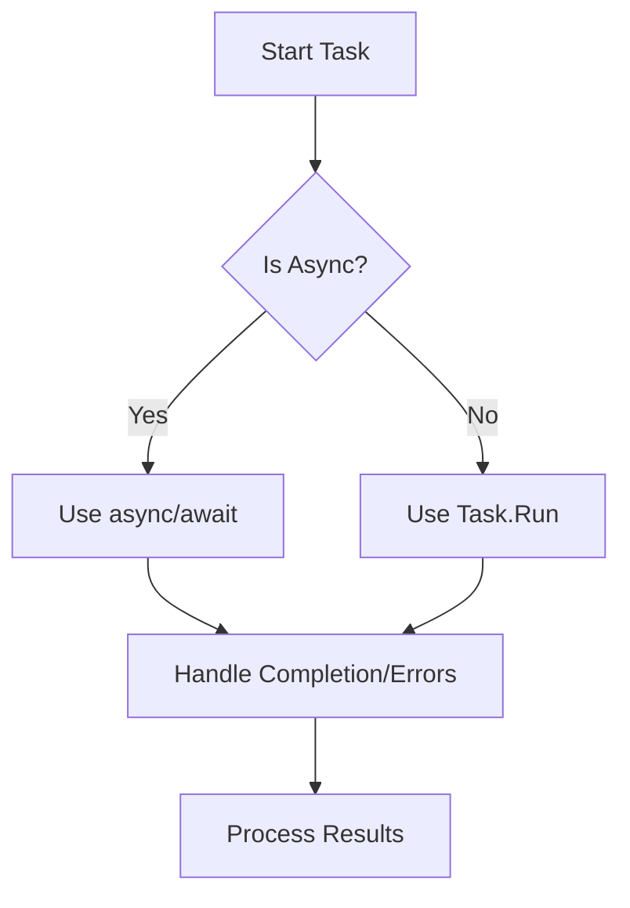

+++
author = "yuhao"
title = "Task in C#"
date = "2025-01-31"
description = "The Task class in C# is a powerful tool for multithreaded programming, enabling asynchronous operations, parallel processing, and task cancellation. This guide demonstrates common patterns and best..."
tags = [
    ".NET",
    ".NET Core",
    "C#",
    "2025",
]
categories = [
    "Programming/Development",
]
image = "cover.jpg"
+++
The `Task` class in C# is a powerful tool for multithreaded programming, enabling asynchronous operations, parallel processing, and task cancellation. This guide demonstrates common patterns and best practices for leveraging `Task` effectively.

---

## 1. Executing Asynchronous Operations

Use `Task.Run` to offload work to the thread pool and `await` to handle completion.

```csharp
static async Task<int> LongRunningOperationAsync()
{
    await Task.Delay(1000);  // Simulates async work (e.g., I/O)
    return 1;
}

static async Task MyMethodAsync()
{
    int result = await Task.Run(() => LongRunningOperationAsync());
    Console.WriteLine(result);  // Output: 1
}
```

**Key Points**:
• `Task.Run` queues work to the thread pool.
• `await` asynchronously waits for completion without blocking the thread.

---

## 2. Parallel Task Processing

Use `Task.WhenAll` to await multiple tasks concurrently.

```csharp
Task<int> task1 = Task.Run(() => LongRunningOperationAsync());
Task<int> task2 = Task.Run(() => LongRunningOperationAsync());
Task<int> task3 = Task.Run(() => LongRunningOperationAsync());

int[] results = await Task.WhenAll(task1, task2, task3);
Console.WriteLine($"Sum: {results.Sum()}");  // Output: Sum: 3
```

**Advantages**:
• Runs tasks in parallel for better CPU utilization.
• Aggregates results when all tasks complete.

---

## 3. Canceling Async Operations

Use `CancellationTokenSource` to gracefully terminate tasks.

```csharp
static async Task<int> LongRunningOperationAsync(CancellationToken cancellationToken)
{
    await Task.Delay(1000, cancellationToken);  // Honors cancellation
    return 1;
}

static async Task MyMethodAsync(CancellationToken cancellationToken)
{
    using var cts = CancellationTokenSource.CreateLinkedTokenSource(cancellationToken);
    cts.CancelAfter(500);  // Auto-cancel after 500ms
    
    try
    {
        int result = await Task.Run(() => LongRunningOperationAsync(cts.Token));
        Console.WriteLine(result);
    }
    catch (TaskCanceledException)
    {
        Console.WriteLine("Operation canceled.");
    }
}
```

**Mechanism**:
• `CancellationToken` propagates cancellation requests.
• `CancelAfter()` triggers cancellation after a timeout.

---

## Best Practices and Pitfalls

### ✅ Do:

• Use `ConfigureAwait(false)` in library code to avoid deadlocks.
• Prefer `async`/`await` over `.Result` or `.Wait()` to prevent blocking.
• Handle exceptions with `try/catch` around awaited tasks.

### ❌ Avoid:

• Mixing synchronous and async code without proper context management.
• Ignoring `OperationCanceledException` when using cancellation tokens.
• Overusing `Task.Run` for CPU-bound work; consider `Parallel.For` instead.

---

## Summary

The `Task` API enables:
• **Asynchronous Programming**: Non-blocking execution for I/O-bound work.
• **Parallelism**: Efficient utilization of multi-core CPUs.
• **Cancellation**: Graceful termination of long-running operations.

By following these patterns, you’ll write responsive, scalable, and maintainable C# applications. For advanced scenarios, explore `ValueTask`, `TaskCompletionSource`, and the TPL Dataflow library.



